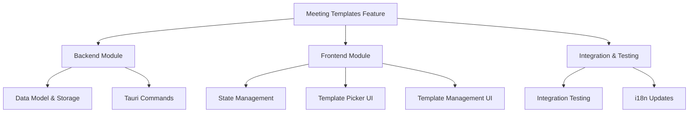
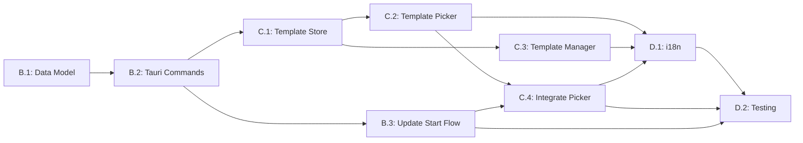

# Feature Implementation Plan: Meeting Templates & Quick Start

**Planning Time**: 2026-01-11
**Estimated Total Effort**: 18 story points (~36 hours)
**Feature Branch**: `feature/meeting-templates`

---

## 1. Feature Overview

### 1.1 Goal

Enable users to create, manage, and quickly start meetings using predefined templates that include title, audio source, and LLM prompt configurations. This feature streamlines the meeting setup process and ensures consistent post-processing for different meeting types (1:1s, team meetings, interviews, etc.).

### 1.2 Scope

**Included**:
- Template CRUD operations (Create, Read, Update, Delete)
- Template storage in tauri-plugin-store
- Template picker UI in Meeting Mode
- Quick Start flow (template → start recording)
- Template management UI in Settings
- Integration with existing LLM prompts
- Backward compatibility with existing "New Meeting" flow

**Not Included**:
- Template import/export
- Template sharing across devices
- Advanced template scheduling
- Template analytics/usage tracking

### 1.3 Technical Constraints

- **Storage**: Use existing tauri-plugin-store (same as settings.rs)
- **Prompt Integration**: Templates reference LLMPrompt.id from post_process_prompts
- **State Management**: Use Zustand pattern (similar to meetingStore.ts)
- **i18n**: All UI strings must be translatable
- **Type Safety**: Full TypeScript + Rust type safety via tauri-specta

---

## 2. WBS Task Breakdown

### 2.1 Task Hierarchy Diagram



### 2.2 Detailed Task List

---

#### **Phase 1: Backend Foundation** (7 story points)

##### Task B.1: Define Template Data Model (2 points)

**File**: `src-tauri/src/settings.rs`

**Description**: Add MeetingTemplate struct and storage helpers.

**Acceptance Criteria**:
- [ ] `MeetingTemplate` struct defined with all required fields
- [ ] Default templates created (at least 3)
- [ ] Template storage functions (load, save, validate) implemented
- [ ] Template ID generation using UUID v4

**Inputs**:
- Existing LLMPrompt structure
- AudioSourceType enum
- Settings storage pattern

**Outputs**:
- MeetingTemplate type exported for use in commands
- default_meeting_templates() function

**Key Steps**:
1. Define MeetingTemplate struct:
```rust
#[derive(Serialize, Deserialize, Debug, Clone, Type)]
pub struct MeetingTemplate {
    pub id: String,
    pub name: String,
    pub icon: String,  // Emoji or icon identifier
    pub title_template: String,  // e.g., "Team Standup - {date}"
    pub audio_source: AudioSourceType,
    pub prompt_id: Option<String>,  // Reference to LLMPrompt.id
    pub created_at: i64,  // Unix timestamp
    pub updated_at: i64,
}
```

2. Add template fields to AppSettings:
```rust
#[serde(default = "default_meeting_templates")]
pub meeting_templates: Vec<MeetingTemplate>,
```

3. Implement default_meeting_templates():
```rust
fn default_meeting_templates() -> Vec<MeetingTemplate> {
    vec![
        MeetingTemplate {
            id: "template_1on1".to_string(),
            name: "1:1 Meeting".to_string(),
            icon: "👥".to_string(),
            title_template: "1:1 - {date}".to_string(),
            audio_source: AudioSourceType::MicrophoneOnly,
            prompt_id: None,
            created_at: 0,
            updated_at: 0,
        },
        // ... 2 more default templates
    ]
}
```

4. Add template CRUD helper functions
5. Update ensure_defaults pattern for templates

**Dependencies**: None (foundational)

**Risk Assessment**: LOW
- Extends existing settings pattern
- No breaking changes

---

##### Task B.2: Implement Tauri Commands for Templates (3 points)

**File**: `src-tauri/src/commands/templates.rs` (NEW)

**Description**: Create Tauri commands for template CRUD operations.

**Acceptance Criteria**:
- [ ] `list_meeting_templates` command implemented
- [ ] `create_meeting_template` command implemented
- [ ] `update_meeting_template` command implemented
- [ ] `delete_meeting_template` command implemented
- [ ] Commands registered in lib.rs
- [ ] All commands use Result<T, String> pattern
- [ ] Validation for name uniqueness and required fields

**Inputs**:
- MeetingTemplate struct from B.1
- Existing command patterns from commands/meeting.rs

**Outputs**:
- 4 Tauri commands exposed to frontend
- TypeScript bindings auto-generated via specta

**Key Steps**:
1. Create new file `src-tauri/src/commands/templates.rs`

2. Implement list_meeting_templates:
```rust
#[tauri::command]
#[specta::specta]
pub fn list_meeting_templates(app: AppHandle) -> Result<Vec<MeetingTemplate>, String> {
    let settings = get_settings(&app);
    Ok(settings.meeting_templates)
}
```

3. Implement create_meeting_template:
```rust
#[tauri::command]
#[specta::specta]
pub fn create_meeting_template(
    app: AppHandle,
    name: String,
    icon: String,
    title_template: String,
    audio_source: AudioSourceType,
    prompt_id: Option<String>,
) -> Result<MeetingTemplate, String> {
    // Validate name not empty
    // Generate new UUID
    // Create template with timestamps
    // Add to settings
    // Save settings
    // Return new template
}
```

4. Implement update_meeting_template
5. Implement delete_meeting_template (with validation for non-default templates)

6. Register commands in `src-tauri/src/lib.rs`:
```rust
mod commands {
    pub mod templates;
    // ...
}

// In app builder:
.invoke_handler(tauri::generate_handler![
    commands::templates::list_meeting_templates,
    commands::templates::create_meeting_template,
    commands::templates::update_meeting_template,
    commands::templates::delete_meeting_template,
    // ...
])
```

**Dependencies**: Task B.1 (requires MeetingTemplate struct)

**Risk Assessment**: MEDIUM
- New command file needs proper module registration
- Need to handle concurrent modifications to settings

**Mitigation**:
- Follow existing command patterns exactly
- Add debug logging for all operations
- Test with multiple rapid calls

---

##### Task B.3: Update Meeting Start Flow (2 points)

**File**: `src-tauri/src/commands/meeting.rs`

**Description**: Modify start_meeting_session to accept optional template_id and auto-populate title.

**Acceptance Criteria**:
- [ ] start_meeting_session accepts optional template_id parameter
- [ ] Title template interpolation implemented ({date}, {time} placeholders)
- [ ] Audio source from template used if provided
- [ ] Prompt ID stored in session metadata for post-processing
- [ ] Existing calls without template_id still work (backward compatible)

**Inputs**:
- Template ID (optional)
- Template data from settings
- Current start_meeting_session implementation

**Outputs**:
- Updated start_meeting_session command signature
- MeetingSession with auto-generated title

**Key Steps**:
1. Update start_meeting_session signature:
```rust
pub fn start_meeting_session(
    app: AppHandle,
    audio_source: Option<AudioSourceType>,
    template_id: Option<String>,  // NEW
) -> Result<MeetingSession, String>
```

2. Add template lookup logic:
```rust
if let Some(tid) = template_id {
    let settings = get_settings(&app);
    if let Some(template) = settings.meeting_templates.iter().find(|t| t.id == tid) {
        // Use template.audio_source if audio_source is None
        // Generate title from template.title_template
        // Store template.prompt_id in session metadata
    }
}
```

3. Implement title template interpolation:
```rust
fn interpolate_title_template(template: &str) -> String {
    let now = chrono::Local::now();
    template
        .replace("{date}", &now.format("%Y-%m-%d").to_string())
        .replace("{time}", &now.format("%H:%M").to_string())
}
```

4. Update MeetingSession struct to include prompt_id metadata (if not already present)

5. Update TypeScript bindings

**Dependencies**: Task B.2 (needs template commands)

**Risk Assessment**: MEDIUM
- Breaking change to start_meeting_session signature
- Need careful backward compatibility testing

**Mitigation**:
- Make template_id optional with default None
- Test all existing meeting start flows
- Add migration guide comment in code

---

#### **Phase 2: Frontend State & Store** (4 story points)

##### Task C.1: Create Template Store (2 points)

**File**: `src/stores/templateStore.ts` (NEW)

**Description**: Create Zustand store for template state management.

**Acceptance Criteria**:
- [ ] Store follows same pattern as meetingStore.ts
- [ ] CRUD actions implemented (fetch, create, update, delete)
- [ ] Loading and error states handled
- [ ] Templates cached in memory
- [ ] Store initialized on app mount

**Inputs**:
- Template Tauri commands from B.2
- meetingStore.ts pattern

**Outputs**:
- templateStore.ts with useTemplateStore hook
- Type-safe template actions

**Key Steps**:
1. Create `src/stores/templateStore.ts`:
```typescript
import { create } from "zustand";
import { subscribeWithSelector } from "zustand/middleware";
import type { MeetingTemplate } from "@/bindings";
import { commands } from "@/bindings";

interface TemplateStore {
  // State
  templates: MeetingTemplate[];
  isLoading: boolean;
  error: string | null;

  // Actions
  fetchTemplates: () => Promise<void>;
  createTemplate: (template: Omit<MeetingTemplate, "id" | "created_at" | "updated_at">) => Promise<void>;
  updateTemplate: (id: string, updates: Partial<MeetingTemplate>) => Promise<void>;
  deleteTemplate: (id: string) => Promise<void>;
  clearError: () => void;
}
```

2. Implement actions with error handling
3. Add optimistic updates for better UX
4. Export useTemplateStore hook

**Dependencies**: Task B.2 (requires Tauri commands)

**Risk Assessment**: LOW
- Well-established pattern from meetingStore

---

##### Task C.2: Create Template Picker Component (2 points)

**File**: `src/components/meeting/TemplatePicker.tsx` (NEW)

**Description**: Create UI component for selecting templates in Meeting Mode.

**Acceptance Criteria**:
- [ ] Grid layout with template cards
- [ ] Template card shows icon, name, and audio source indicator
- [ ] "New Meeting" option (no template) always available
- [ ] Active template visually highlighted
- [ ] Responsive layout (2-3 columns)
- [ ] All strings use i18n

**Inputs**:
- Templates from templateStore
- Design spec from UI/UX document

**Outputs**:
- TemplatePicker component
- TemplateCard sub-component

**Key Steps**:
1. Create TemplatePicker.tsx:
```tsx
export const TemplatePicker: React.FC<{
  selectedTemplateId: string | null;
  onSelectTemplate: (templateId: string | null) => void;
}> = ({ selectedTemplateId, onSelectTemplate }) => {
  const { templates } = useTemplateStore();
  const { t } = useTranslation();

  return (
    <div className="grid grid-cols-2 md:grid-cols-3 gap-3">
      {/* "New Meeting" card (no template) */}
      <TemplateCard
        template={null}
        isSelected={selectedTemplateId === null}
        onClick={() => onSelectTemplate(null)}
      />

      {templates.map(template => (
        <TemplateCard
          key={template.id}
          template={template}
          isSelected={selectedTemplateId === template.id}
          onClick={() => onSelectTemplate(template.id)}
        />
      ))}
    </div>
  );
};
```

2. Create TemplateCard sub-component with hover effects
3. Add audio source icons (microphone, system, mixed)
4. Implement responsive grid

**Dependencies**: Task C.1 (requires templateStore)

**Risk Assessment**: LOW
- Pure UI component with clear inputs/outputs

---

#### **Phase 3: Template Management UI** (4 story points)

##### Task C.3: Create Template Manager Settings (3 points)

**File**: `src/components/settings/templates/TemplateManager.tsx` (NEW)

**Description**: Create template management UI in Settings section.

**Acceptance Criteria**:
- [ ] List view showing all templates
- [ ] Add/Edit/Delete actions
- [ ] Modal dialog for create/edit
- [ ] Form validation (name required, max 50 chars)
- [ ] Prompt selector dropdown (populated from post_process_prompts)
- [ ] Audio source selector
- [ ] Icon/emoji picker
- [ ] Default templates cannot be deleted (show warning)
- [ ] All strings use i18n

**Inputs**:
- Templates from templateStore
- LLM prompts from settingsStore
- Design spec from UI/UX document

**Outputs**:
- TemplateManager component
- TemplateFormModal component
- Export from settings index

**Key Steps**:
1. Create TemplateManager.tsx with list view
2. Create TemplateFormModal.tsx with form fields:
   - Name (text input)
   - Icon (emoji picker or text input)
   - Title Template (text input with help text showing placeholders)
   - Audio Source (radio group)
   - Prompt (dropdown from available prompts)

3. Implement validation logic
4. Add delete confirmation dialog
5. Handle optimistic UI updates

6. Register in settings sections (if using new section):
```typescript
// In Sidebar.tsx SECTIONS_CONFIG
templates: {
  labelKey: "sidebar.templates",
  icon: FileTemplate,
  component: TemplateManager,
  enabled: () => true,
}
```

OR integrate into existing Meeting settings section.

**Dependencies**: Task C.1 (requires templateStore)

**Risk Assessment**: MEDIUM
- Complex form validation
- Need proper UX for emoji/icon selection

**Mitigation**:
- Use existing form patterns from PromptManager.tsx
- Provide simple text input for icon as MVP (emoji picker can be Phase 2)
- Add clear help text for title template placeholders

---

##### Task C.4: Integrate Template Picker into Meeting Mode (1 point)

**File**: `src/components/meeting/MeetingMode.tsx`

**Description**: Add TemplatePicker to MeetingMode and wire up to start flow.

**Acceptance Criteria**:
- [ ] TemplatePicker displayed above "Start Meeting" button
- [ ] Selected template state managed in MeetingMode
- [ ] Selected template passed to startMeeting action
- [ ] UI shows which template was used after meeting starts
- [ ] Collapsible section to save space (optional enhancement)

**Inputs**:
- TemplatePicker component from C.2
- Existing MeetingMode component
- meetingStore.startMeeting action

**Outputs**:
- Updated MeetingMode with template selection

**Key Steps**:
1. Add selectedTemplateId state to MeetingMode:
```tsx
const [selectedTemplateId, setSelectedTemplateId] = useState<string | null>(null);
```

2. Add TemplatePicker before start button:
```tsx
<TemplatePicker
  selectedTemplateId={selectedTemplateId}
  onSelectTemplate={setSelectedTemplateId}
/>
```

3. Update meetingStore.startMeeting call to pass template_id:
```tsx
await startMeeting(audioSource, selectedTemplateId);
```

4. Update meetingStore.ts startMeeting signature to accept template_id

5. Display selected template name during recording (optional)

**Dependencies**: Task C.2, B.3

**Risk Assessment**: LOW
- Simple state wiring

---

#### **Phase 4: Integration & Polish** (3 story points)

##### Task D.1: Update i18n Translations (1 point)

**Files**:
- `src/i18n/locales/en/translation.json`
- `src/i18n/locales/es/translation.json`
- `src/i18n/locales/fr/translation.json`
- `src/i18n/locales/vi/translation.json`

**Description**: Add all new translation keys for templates feature.

**Acceptance Criteria**:
- [ ] All hardcoded strings replaced with t() calls
- [ ] English translations complete
- [ ] Other language files updated (can be English fallback for now)
- [ ] Translation keys organized under "templates" namespace

**Inputs**:
- All template UI components
- Existing translation structure

**Outputs**:
- Updated translation.json files

**Key Steps**:
1. Add English translations:
```json
"templates": {
  "title": "Meeting Templates",
  "newTemplate": "New Template",
  "editTemplate": "Edit Template",
  "deleteTemplate": "Delete Template",
  "deleteConfirm": "Are you sure you want to delete this template?",
  "form": {
    "name": "Template Name",
    "namePlaceholder": "e.g., Team Standup",
    "icon": "Icon/Emoji",
    "iconPlaceholder": "📋",
    "titleTemplate": "Title Template",
    "titleTemplatePlaceholder": "Team Standup - {date}",
    "titleTemplateHelp": "Use {date} for current date, {time} for current time",
    "audioSource": "Audio Source",
    "prompt": "Summary Prompt",
    "promptNone": "No automatic summary"
  },
  "audioSources": {
    "microphone_only": "Microphone Only",
    "system_only": "System Audio Only",
    "mixed": "Microphone + System"
  },
  "default": {
    "newMeeting": "New Meeting",
    "newMeetingDesc": "Start without a template"
  },
  "errors": {
    "nameRequired": "Template name is required",
    "nameTooLong": "Template name must be 50 characters or less",
    "cannotDeleteDefault": "Default templates cannot be deleted"
  }
}
```

2. Copy to other language files (es, fr, vi)
3. Add sidebar translation if new section:
```json
"sidebar": {
  "templates": "Templates"
}
```

**Dependencies**: All UI tasks (C.2, C.3, C.4)

**Risk Assessment**: LOW
- Straightforward translation addition

---

##### Task D.2: Integration Testing & Bug Fixes (2 points)

**Description**: End-to-end testing of template feature and bug fixes.

**Acceptance Criteria**:
- [ ] Can create, edit, delete custom templates
- [ ] Default templates cannot be deleted
- [ ] Quick Start flow works (select template → start → correct title/audio/prompt)
- [ ] Backward compatibility: "New Meeting" (no template) still works
- [ ] Template picker updates immediately after creating template
- [ ] Error states handled gracefully
- [ ] No console errors or warnings
- [ ] Works on macOS, Windows, Linux

**Test Scenarios**:
1. **Template CRUD**:
   - Create new template with all fields
   - Edit existing template
   - Delete custom template
   - Attempt to delete default template (should fail gracefully)

2. **Quick Start Flow**:
   - Select template "1:1 Meeting"
   - Start meeting
   - Verify title is "1:1 - 2026-01-11" (or current date)
   - Verify audio source matches template
   - Stop meeting and generate summary
   - Verify prompt from template is used

3. **Backward Compatibility**:
   - Select "New Meeting" (no template)
   - Start meeting
   - Verify default title behavior (empty or prompt for title)

4. **Edge Cases**:
   - Create template with empty prompt_id (no summary)
   - Template with special characters in title template
   - Rapid create/delete operations

**Bug Fix Protocol**:
- Document all bugs in issue tracker
- Fix P0/P1 bugs before merge
- P2 bugs can be follow-up tasks

**Dependencies**: All previous tasks

**Risk Assessment**: HIGH
- Integration issues may surface here
- Cross-platform differences

**Mitigation**:
- Test on all platforms early
- Have rollback plan (feature flag)
- Beta test with internal users first

---

## 3. Dependencies & Critical Path

### 3.1 Dependency Graph



### 3.2 Critical Path

**Longest path (13 points)**:
B.1 (2) → B.2 (3) → B.3 (2) → C.4 (1) → D.1 (1) → D.2 (2) → C.1 (2) parallel track

**Serial tasks**: B.1 → B.2 → B.3 → C.4 → D.2
**Parallel opportunities**:
- C.1 (Template Store) can start after B.2 completes
- C.3 (Template Manager) can develop in parallel with C.2/C.4
- D.1 (i18n) can start early with placeholder keys

### 3.3 Parallel Work Opportunities

| Developer 1 | Developer 2 |
|-------------|-------------|
| B.1 → B.2 → B.3 | (waiting) |
| C.4 → D.2 | C.1 → C.2 → C.3 |
| (both work on D.1 together) | |

---

## 4. File Checklist

### 4.1 New Files

| File Path | Type | Task | Purpose |
|-----------|------|------|---------|
| `src-tauri/src/commands/templates.rs` | Rust | B.2 | Template CRUD commands |
| `src/stores/templateStore.ts` | TypeScript | C.1 | Template state management |
| `src/components/meeting/TemplatePicker.tsx` | TSX | C.2 | Template selection UI |
| `src/components/settings/templates/TemplateManager.tsx` | TSX | C.3 | Template management |
| `src/components/settings/templates/TemplateFormModal.tsx` | TSX | C.3 | Template create/edit form |
| `src/components/settings/templates/index.ts` | TypeScript | C.3 | Exports |

### 4.2 Modified Files

| File Path | Changes | Task |
|-----------|---------|------|
| `src-tauri/src/settings.rs` | Add MeetingTemplate struct, defaults | B.1 |
| `src-tauri/src/lib.rs` | Register template commands | B.2 |
| `src-tauri/src/commands/meeting.rs` | Update start_meeting_session signature | B.3 |
| `src/stores/meetingStore.ts` | Add template_id parameter to startMeeting | C.4 |
| `src/components/meeting/MeetingMode.tsx` | Integrate TemplatePicker | C.4 |
| `src/components/Sidebar.tsx` | Add templates section (optional) | C.3 |
| `src/i18n/locales/en/translation.json` | Add template translations | D.1 |
| `src/i18n/locales/es/translation.json` | Add template translations | D.1 |
| `src/i18n/locales/fr/translation.json` | Add template translations | D.1 |
| `src/i18n/locales/vi/translation.json` | Add template translations | D.1 |
| `src/bindings.ts` | Auto-generated TypeScript types | B.2 |

---

## 5. Technical Implementation Details

### 5.1 Data Flow

```
User selects template in UI
  ↓
TemplatePicker updates selectedTemplateId state
  ↓
User clicks "Start Meeting"
  ↓
MeetingMode calls startMeeting(audioSource, templateId)
  ↓
meetingStore dispatches to Tauri command
  ↓
start_meeting_session(app, audioSource, templateId)
  ↓
Backend looks up template from settings
  ↓
Generates title from template.title_template
  ↓
Uses template.audio_source if provided
  ↓
Stores template.prompt_id in session metadata
  ↓
Returns MeetingSession with auto-generated title
  ↓
Frontend displays recording UI with title
```

### 5.2 Title Template Interpolation

**Supported Placeholders**:
- `{date}` → Current date in YYYY-MM-DD format (e.g., "2026-01-11")
- `{time}` → Current time in HH:MM format (e.g., "14:30")
- `{datetime}` → Full datetime (future enhancement)

**Example**:
```
Template: "Team Standup - {date} {time}"
Output: "Team Standup - 2026-01-11 14:30"
```

### 5.3 Prompt Integration

When a meeting is started with a template that has a `prompt_id`:

1. The prompt_id is stored in MeetingSession metadata
2. When user clicks "Generate Summary" in the completed meeting:
   - Frontend checks if session has prompt_id metadata
   - If yes, use that prompt instead of currently selected prompt
   - If no, use currently selected prompt from settings

**Future Enhancement**: Allow user to override template prompt at generation time.

---

## 6. Risk Assessment & Mitigation

### 6.1 Technical Risks

| Risk | Probability | Impact | Mitigation |
|------|-------------|--------|------------|
| Breaking change to start_meeting_session | MEDIUM | HIGH | Make template_id optional, extensive backward compatibility testing |
| Template storage corruption | LOW | HIGH | Add data validation, migration logic, backup on modification |
| UI performance with many templates | LOW | MEDIUM | Implement virtualized list if > 20 templates |
| Tauri command registration conflicts | LOW | MEDIUM | Follow exact pattern from existing commands |

### 6.2 UX Risks

| Risk | Probability | Impact | Mitigation |
|------|-------------|--------|------------|
| Template picker clutters Meeting UI | MEDIUM | MEDIUM | Make collapsible, show only 6 templates by default with "See all" |
| Users confused by title template syntax | MEDIUM | LOW | Add clear help text with examples |
| Accidental template deletion | MEDIUM | MEDIUM | Confirmation dialog, cannot delete defaults |

### 6.3 Project Risks

| Risk | Probability | Impact | Mitigation |
|------|-------------|--------|------------|
| Scope creep (template sharing, etc.) | MEDIUM | MEDIUM | Strict adherence to MVP scope, defer enhancements |
| Testing takes longer than estimated | HIGH | LOW | Start testing early (task D.2), parallelize where possible |

---

## 7. Testing Strategy

### 7.1 Unit Tests

**Backend** (`src-tauri/src/settings.rs`):
- [ ] Template validation (name required, max length)
- [ ] Title template interpolation with various date/time formats
- [ ] Default template generation
- [ ] Template CRUD operations

**Frontend** (`src/stores/templateStore.ts`):
- [ ] Store actions (fetchTemplates, createTemplate, etc.)
- [ ] Error handling
- [ ] Optimistic updates

### 7.2 Integration Tests

- [ ] Create template → appears in picker
- [ ] Delete template → removed from picker
- [ ] Start meeting with template → correct title/audio/prompt
- [ ] Start meeting without template → existing behavior unchanged

### 7.3 E2E Test Scenarios

**Scenario 1: Happy Path**
1. Open Settings → Templates
2. Click "New Template"
3. Fill form: Name="Client Call", Icon="📞", Title="{date} Client Call", Audio=Microphone Only, Prompt=None
4. Save
5. Go to Meeting Mode
6. Select "Client Call" template
7. Start meeting
8. Verify title is "2026-01-11 Client Call"
9. Stop meeting
10. Verify audio was recorded from microphone only

**Scenario 2: Template with Prompt**
1. Create template with prompt_id set to "improve_transcriptions"
2. Start meeting with this template
3. Stop meeting and generate summary
4. Verify "Improve Transcriptions" prompt was used

**Scenario 3: Backward Compatibility**
1. Select "New Meeting" (no template)
2. Start meeting
3. Verify existing flow works (empty title or prompt for title)

### 7.4 Manual Testing Checklist

Platform-specific testing:
- [ ] macOS: Template picker layout, emoji rendering
- [ ] Windows: Template picker layout, emoji rendering
- [ ] Linux: Template picker layout, emoji rendering

Accessibility:
- [ ] Keyboard navigation in template picker
- [ ] Screen reader announces template names
- [ ] Focus indicators visible

---

## 8. Rollout Plan

### 8.1 Phased Rollout

**Phase 1: Internal Alpha** (1 day)
- Deploy to internal testers
- Focus on critical path testing
- Fix P0 bugs

**Phase 2: Beta Release** (3 days)
- Announce in beta channel
- Collect feedback on UX
- Fix P1 bugs, document P2 for future

**Phase 3: General Release** (7 days after beta)
- Merge to main
- Include in next release notes
- Monitor user feedback

### 8.2 Feature Flag (Optional)

If high risk, consider feature flag:
```typescript
// In config or settings
const FEATURE_FLAGS = {
  meeting_templates: true, // Toggle to disable
};
```

Use in UI:
```tsx
{FEATURE_FLAGS.meeting_templates && <TemplatePicker />}
```

### 8.3 Rollback Plan

If critical bugs discovered post-release:

1. **Quick Fix** (if possible within 2 hours):
   - Hot patch the specific issue
   - Deploy patch release

2. **Feature Disable** (if fix > 2 hours):
   - Set feature flag to false
   - Push config update
   - Fix in development branch
   - Re-enable after thorough testing

3. **Full Revert** (if structural issues):
   - Revert merge commit
   - Remove from release notes
   - Schedule for next cycle after fixes

---

## 9. Success Metrics

### 9.1 Acceptance Criteria (Pre-Launch)

- [ ] All tasks in WBS completed
- [ ] All unit tests passing
- [ ] E2E test scenarios pass on all platforms
- [ ] No P0/P1 bugs open
- [ ] Code review approved
- [ ] Documentation updated

### 9.2 Post-Launch Metrics (Optional)

Track in analytics (if implemented):
- Template usage rate (% of meetings started with template)
- Most used templates
- Custom templates created per user
- Time saved vs. manual title entry

**Success Threshold**: 30% of meetings use templates within 2 weeks of release.

---

## 10. Future Enhancements (Phase 2)

Not included in MVP, but documented for future:

1. **Template Import/Export**
   - JSON format for sharing templates
   - Community template marketplace

2. **Advanced Title Templates**
   - More placeholders: {week_number}, {month}, {year}
   - Conditional logic: "Q{quarter} Planning"

3. **Template Categories**
   - Group templates by type (Work, Personal, etc.)
   - Filter/search in picker

4. **Template Analytics**
   - Track usage statistics
   - Show "most used" badge

5. **Template Scheduling**
   - Recurring meetings (daily standup at 9am)
   - Auto-start from calendar integration

6. **Template Presets Library**
   - Ship with 10+ pre-made templates
   - One-click install from library

---

## 11. Developer Notes

### 11.1 Code Style

**Rust**:
- Use existing settings.rs patterns for template storage
- Follow existing error handling (Result<T, String>)
- Add doc comments for public functions

**TypeScript**:
- Use functional components with hooks
- Strict typing, avoid `any`
- Follow existing store patterns (Zustand)

**i18n**:
- All user-facing strings must use `t()` calls
- Group related keys under "templates" namespace

### 11.2 Common Pitfalls

❌ **Don't**:
- Hardcode template IDs (use UUID generation)
- Forget to validate template name uniqueness
- Skip backward compatibility testing
- Use `unwrap()` in Rust production code

✅ **Do**:
- Use the same store pattern as meetingStore.ts
- Add clear help text for title templates
- Test on all platforms before PR
- Document any breaking changes

### 11.3 Debugging Tips

**Backend**:
```bash
# Enable debug logging
export RUST_LOG=handy=debug
bun run tauri dev
```

Check logs at:
- macOS: `~/Library/Logs/com.handy.app/`
- Windows: `%APPDATA%\com.handy.app\logs\`

**Frontend**:
```typescript
// Add to templateStore for debugging
console.log("Templates loaded:", templates);
```

---

## 12. Approval & Sign-off

**Reviewed by**: ___________________
**Approved by**: ___________________
**Date**: ___________________

**Ready to start development**: ☐ Yes  ☐ No

---

## Appendix A: Default Templates Specification

```typescript
const DEFAULT_TEMPLATES: MeetingTemplate[] = [
  {
    id: "template_1on1",
    name: "1:1 Meeting",
    icon: "👥",
    title_template: "1:1 - {date}",
    audio_source: "microphone_only",
    prompt_id: null,
    created_at: 0,
    updated_at: 0,
  },
  {
    id: "template_team_standup",
    name: "Team Standup",
    icon: "☕",
    title_template: "Standup - {date}",
    audio_source: "mixed",
    prompt_id: "default_improve_transcriptions",
    created_at: 0,
    updated_at: 0,
  },
  {
    id: "template_interview",
    name: "Interview",
    icon: "🎤",
    title_template: "Interview - {date}",
    audio_source: "microphone_only",
    prompt_id: null,
    created_at: 0,
    updated_at: 0,
  },
];
```

---

## Appendix B: TypeScript Type Definitions

```typescript
// Auto-generated from tauri-specta (src/bindings.ts)

export interface MeetingTemplate {
  id: string;
  name: string;
  icon: string;
  title_template: string;
  audio_source: AudioSourceType;
  prompt_id: string | null;
  created_at: number;
  updated_at: number;
}

export type AudioSourceType =
  | "microphone_only"
  | "system_only"
  | "mixed";

// Commands
export namespace commands {
  export function listMeetingTemplates(): Promise<Result<MeetingTemplate[], string>>;
  export function createMeetingTemplate(
    name: string,
    icon: string,
    titleTemplate: string,
    audioSource: AudioSourceType,
    promptId: string | null
  ): Promise<Result<MeetingTemplate, string>>;
  export function updateMeetingTemplate(
    id: string,
    name?: string,
    icon?: string,
    titleTemplate?: string,
    audioSource?: AudioSourceType,
    promptId?: string | null
  ): Promise<Result<MeetingTemplate, string>>;
  export function deleteMeetingTemplate(id: string): Promise<Result<void, string>>;
  export function startMeetingSession(
    audioSource?: AudioSourceType,
    templateId?: string
  ): Promise<Result<MeetingSession, string>>;
}
```

---

**END OF IMPLEMENTATION PLAN**

*This plan follows WBS methodology and is ready for execution. Each task has clear acceptance criteria, dependencies, and risk assessments. Total estimated effort: 18 story points (~36 hours).*
